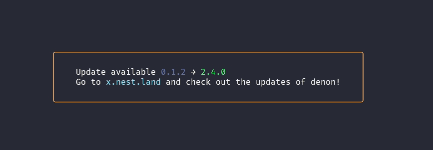
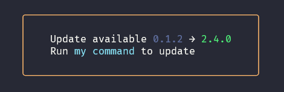
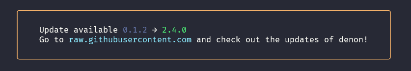
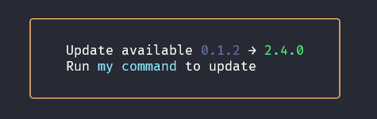
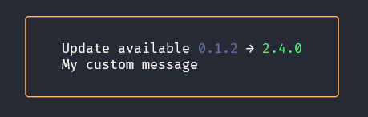

<br />
<p align="center">
  <a href="https://github.com/nestdotland/nest.land">
    
  </a>

<h3 align="center">Hatcher</h3>
<p align="center">
    Registries toolbox & update notifications for your CLI
  </p>
  <p align="center">
    <a href="https://nest.land/package/hatcher">
      
    </a>
    
    
    
    <a href="https://discord.gg/hYUsX3H">
      
    </a>
  </p>
</p>



> Inspired by the node package
> [update-notifier](https://github.com/yeoman/update-notifier).

# Contents

- [Contents](#contents)
- [Usage](#usage)
  - [Update Notifier](#update-notifier)
    - [Simple](#simple)
    - [Comprehensive](#comprehensive)
    - [Adding update notification to any CLI](#adding-update-notification-to-any-cli)
    - [How](#how)
  - [Registries toolbox](#registries-toolbox)
- [API](#api)
  - [notifier = UpdateNotifier({ name, owner, registry, currentVersion,
    updateCheckInterval})](#notifier--updatenotifier-name-owner-registry-currentversion-updatecheckinterval)
    - [name](#name)
    - [owner](#owner)
    - [registry](#registry)
    - [currentVersion](#currentversion)
    - [updateCheckInterval](#updatecheckinterval)
  - [notifier.checkForUpdates(configDir)](#notifiercheckforupdatesconfigdir)
  - [notifier.notify(command, overwrite)](#notifiernotifycommand-overwrite)
    - [command](#command)
    - [overwrite](#overwrite)
    - [Custom message](#custom-message)
  - [Update](#update)
  - [Registry Class](#registry-class)
  - [latestVersion(registryDomain, module,
    owner)](#latestversionregistrydomain-module-owner)
    - [registryDomain](#registrydomain)
    - [module](#module)
    - [owner](#owner-1)
    - [return type](#return-type)
  - [latestStableVersion(registryDomain, module,
    owner)](#lateststableversionregistrydomain-module-owner)
  - [sortedVersions(registryDomain, module,
    owner)](#sortedversionsregistrydomain-module-owner)
    - [registryDomain](#registrydomain-1)
    - [module](#module-1)
    - [owner](#owner-2)
    - [return type](#return-type-1)
  - [parseURL(url)](#parseurlurl)
    - [url](#url)
    - [return type](#return-type-2)
  - [getRegistry(registryDomain)](#getregistryregistrydomain)
    - [registryDomain](#registrydomain-2)
    - [return type](#return-type-3)
- [Contributing](#contributing)

# Usage

## Update Notifier

### Simple

```ts
import {
  NestLand,
  UpdateNotifier,
} from "https://x.nest.land/hatcher@0.9.2/mod.ts";

const notifier = new UpdateNotifier({
  name: "denon",
  registry: NestLand,
  currentVersion: "0.1.2",
});

await notifier.checkForUpdates();
notifier.notify();
```

### Comprehensive

```ts
import {
  Github,
  UpdateNotifier,
} from "https://x.nest.land/hatcher@0.9.2/mod.ts";

const notifier = new UpdateNotifier({
  name: "denon", // module name
  owner: "denosaurs", // module owner, mandatory for registries like github
  registry: Github, // registry object
  currentVersion: "0.1.2",
  updateCheckInterval: 1000 * 60 * 60, // time interval between two checks, in milliseconds
});

const update = await notifier.checkForUpdates(); // undefined if there is no update available
console.log(update);
/** {
  current: "0.1.2",
  latest: "2.4.0",
  type: "major",
  name: "denon",
  owner: "denosaurs",
  registry: "raw.githubusercontent.com"
} */

notifier.notify("my command"); // displays the default notification with a custom command
```



### Adding update notification to any CLI

Suppose denon does not use hatcher to notify its users of updates.

**You can install denon with hatcher built-in !**

If the install command is :

```sh
deno install --allow-read --allow-run --allow-write --allow-net -f -q --unstable https://deno.land/x/denon@2.4.0/denon.ts
```

You can do:

```sh
deno install -A https://x.nest.land/hatcher@0.9.2/hatcher.ts
hatcher --allow-read --allow-run --allow-write --allow-net -f -q --unstable https://deno.land/x/denon@2.4.0/denon.ts
```

And voila ! You will be notified as soon as an update is available.

### How

Whenever you initiate the update notifier and it's not within the interval
threshold, it will asynchronously check with the specified registry for
available updates, then persist the result. This prevents any impact on your
module startup performance.

The first time the user runs your app, it will check for an update, and even if
an update is available, it will wait the specified updateCheckInterval before
notifying the user (one day by default). This is done to not be annoying to the
user, but might surprise you as an implementer if you're testing whether it
works. Check out example.ts to quickly test out hatcher and see how you can test
that it works in your app.

```sh
deno run -A https://x.nest.land/hatcher@0.9.2/example.ts
```

## Registries toolbox

```ts
import {
  getLatestVersion,
  parseURL,
} from "https://x.nest.land/hatcher@0.9.2/mod.ts";

const result = parseURL("https://deno.land/x/denon@1.2.0/src/runner.ts");
/** {
  registry: "deno.land",
  name: "denon",
  version: "1.2.0",
  parsedURL: "https://deno.land/x/denon@${version}/src/runner.ts",
  relativePath: "src/runner.ts",
  owner: ""
} */

const latestVersion = await getLatestVersion("deno.land", "denon");
console.log(latestVersion); // 0.2.4
```

# API

## notifier = UpdateNotifier({ name, owner, registry, currentVersion, updateCheckInterval})

### name

_required_

type: `string`

### owner

_required for raw.githubusercontent.com, denopkg.com_

type: `string`

### registry

_required_

type: [`Registry`](#registry-class)

### currentVersion

_required_

type: `string | semver.SemVer`

### updateCheckInterval

In milliseconds, defaults to one day.

type: `number`

## notifier.checkForUpdates(configDir)

`configDir` is the directory where hatcher will save some information about your
module.

Defaults to `~/.deno/hatcher`

Returns an [`Update`](#update) object if there is an update available,
`undefined` otherwise.

## notifier.notify(command, overwrite)

By default, will ask the user to visit the registry.

```ts
notifier.notify();
```



### command

type: `string`

```ts
notifier.notify("my command");
```



### overwrite

type: `boolean`

Will overwrite the body of the notification.

```ts
notifier.notify("My custom message", true);
```



### Custom message

You can of course also display a fully customized message if an
[update](#update) is available.

```ts
const update = await notifier.checkForUpdates();
if (update) {
  console.log(`New update! ${update.latest}`);
}
```

## Update

```ts
{
  latest:
  string;
  current:
  string;
  type:
  semver.ReleaseType | null; // "pre" | "major" | "premajor" | "minor" | "preminor" | "patch" | "prepatch" | "prerelease" | null
  name:
  string;
  owner:
  string;
  registry:
  string;
}
```

## Registry Class

Supported registers for the time being:

| domain (string)             | Registry class |
| --------------------------- | -------------- |
| `deno.land`                 | `DenoLand`     |
| `denopkg.com`               | `Denopkg`      |
| `raw.githubusercontent.com` | `Github`       |
| `jspm.dev`                  | `Jspm`         |
| `x.nest.land`               | `NestLand`     |
| `cdn.skypack.dev`           | `Skypack`      |

You can add your own registers by adding them to `registries`.

```ts
import { registries } from "https://x.nest.land/hatcher@0.9.2/mod.ts";

registries.push(myRegistry);
```

Your registry must implement the Registry object:

```ts
abstract class Registry {
  static domain: string;

  static async latestVersion(
    module: string,
    owner?: string,
  ): Promise<string | undefined>;

  static async latestStableVersion(
    module: string,
    owner?: string,
  ): Promise<string | undefined>;

  static async sortedVersions(
    module: string,
    owner?: string,
  ): Promise<string[]>;

  static parseURL(url: string): URLData;
}
```

## latestVersion(registryDomain, module, owner)

Get latest version from supported registries

### registryDomain

_required_

type: `string`

One of the [supported registries](#registry-class) domain.

### module

_required_

type: `string`

### owner

_required for raw.githubusercontent.com, denopkg.com_

type: `string`

### return type

type: `string`

## latestStableVersion(registryDomain, module, owner)

Same as `latestVersion` but get the latest stable version according to the
SemVer rules.

## sortedVersions(registryDomain, module, owner)

Get sorted versions from supported registries

### registryDomain

_required_

type: `string`

One of the [supported registries](#registry-class) domain.

### module

_required_

type: `string`

### owner

_required for raw.githubusercontent.com, denopkg.com_

type: `string`

### return type

type: `string[]`

## parseURL(url)

Parse an URL from supported registries

### url

_required_

type: `string`

### return type

```ts
interface ProcessedURL {
  registry: string;
  name: string;
  owner: string;
  version: string;
  parsedURL: string;
  relativePath: string;
}
```

## getRegistry(registryDomain)

Get registry object from web domain

### registryDomain

_required_

type: `string`

### return type

type: `Registry`

# Contributing


All contributions are welcome! If you can think of a command or feature that
might benefit nest.land, fork this repository and make a pull request from your
branch with the additions. Make sure to use
[Conventional Commits](https://www.conventionalcommits.org/en/v1.0.0/)

[Contribution guide](.github/CONTRIBUTING.md)
